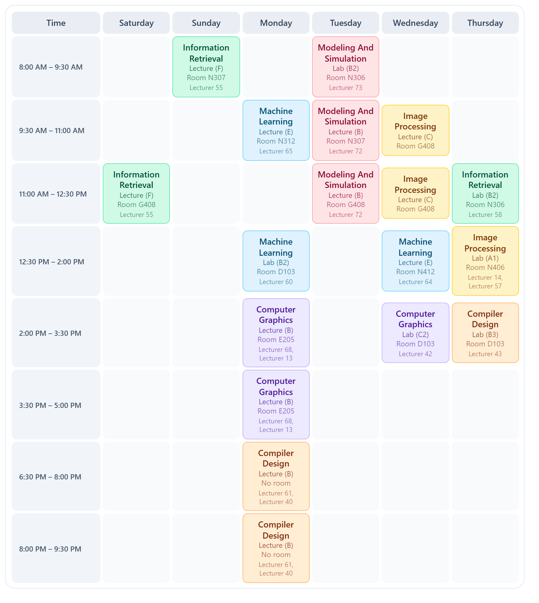

# Semester Timetable

Every semester a university publishes one PDF listing every class it will run.
Somewhere inside it are the handful of weekly timetables that fit the courses
*you* are taking — and finding them by hand means checking hundreds of group
combinations for clashes.

This does it for you. Upload the PDF, pick your courses, and browse **every**
conflict-free timetable those courses allow.

**[→ Open the app](https://my-semester-timetable.vercel.app)**



---

## What it does

**Reads the PDF.** Both the main class schedule and the optional English
schedule, including the parts ordinary text extraction gets wrong.

**Finds every timetable.** A course is taken as a whole — one group of each
component it offers — and lecture, lab and tutorial groups are chosen
independently, so Lecture E with Lab B2 is a normal combination. Six courses
multiply out past a hundred million possibilities; the whole space is counted
exactly and made browsable.

**Narrows it down.** Days that must stay free, hours you can be on campus,
different hours for one particular day, a cap on days per week, individual
busy hours, lecturers to insist on or avoid, and per-course group rules. Every
rule applies at once.

**Explains a dead end.** When nothing fits, it names the course or the pair of
courses responsible and offers the one change that would unblock it.

---

## Using it

### Narrowing the search

Rules come in three widening scopes, all applied together.

| Scope | Rules |
|---|---|
| **Your week** | Days off · earliest and latest hour · different hours for one day · at most *n* days a week · click-to-block busy hours |
| **Lecturers** | Insist on or avoid anyone teaching your courses, across every course at once |
| **Per course** | Pin a group, rule one out, or set a lecturer rule for that course alone |

Group and lecturer chips cycle on repeated clicks: **only this** (blue), then
**never this** (red), then no preference. Lecturers add **wanted** (green) as
the first state.

Insisting on a lecturer reaches only as far as they actually teach — their
courses, and within those, only the classes they give. Asking for the doctor
who lectures does not rule out that course's labs.

### Reading the results

The header gives the exact size of the space. Facets slice it by the things
that matter — days on campus, which day comes out free, waiting time between
classes, when the earliest class starts, how many evenings — each with a
count. Seven rankings pull the best to the front. Paging works by number, so
timetable #4,271,993 is one keystroke away.

### Deciding

Click any class in the full-size view to keep that group, rule it out, avoid
its lecturer everywhere, or block that hour — without leaving the timetable.

Star the good ones and **Compare** puts them side by side, highlighting the
courses whose group actually differs between them.

### Keeping one

Every timetable lists the exact groups to register. Save it as an image, print
it to PDF, add it to a calendar as weekly recurring events, or copy a link
carrying your courses and rules.

The semester, your courses, every rule and every starred timetable stay in
your browser, so a refresh returns straight to the results.

---

## How it works

```
backend/     Python + FastAPI. Reads PDFs. Nothing else — it holds no state.
frontend/    React + TypeScript. Owns the search, in a Web Worker.
api/         Vercel's entry point into the backend.
```

Reading the PDF needs character-level positioning that `pdfplumber` does well
and browser PDF libraries do not. Searching needs to re-run the instant a
filter changes, so it belongs next to the interface — and running it in the
browser means the server costs nothing per student.

### Reading the PDF

`backend/app/parsing/` turns each page into rows of column-addressed text by
clustering characters, then hands them to the parser for that file's layout.
Working from character positions rather than extracted words is what makes the
awkward cases readable:

- `pdftotext -layout` shuffles day, time and room onto neighbouring rows.
- A long course name overflows its column, so word extraction returns
  `English for academic purposGes` — one blob holding both the name and the
  group letter `G`. The characters are still in the right places, so slicing
  by x-range recovers `English for academic purposes` and group `G`.
- A class with two lecturers is printed as two identical rows; they merge into
  one session carrying both names.
- `Work_Shop` is printed as `Work_Sho` with its tail on the next line — and at
  a page break the tail is dropped entirely.

**Anything the parser cannot classify becomes a warning, never a silent
omission.** Warnings are shown before you choose any courses, so a change in
next semester's format is visible rather than quietly dropping classes from
your options.

### Searching

`frontend/src/solver/` represents a timetable as occupied half-hour cells, one
32-bit word per day, so testing two choices for a clash is a handful of
bitwise ANDs. The space is walked twice, and never stored:

- `count` sizes it exactly — cheap enough to run first, so the headline number
  appears while the rest is still being computed.
- `sweep` measures it: facet counts and the best few timetables per ranking.
  Nothing is kept per timetable, so memory stays flat.
- `page` walks it again in the same order to emit one slice, which is what
  makes any timetable reachable by its number.

Both walks share one ordering, so a page number means the same thing every
time. If a walk exceeds its budget it says so — a partial count is never
presented as the whole truth.

Measured on a real semester: 2,574 timetables for three courses in under a
tenth of a second; 1,706,322 for six, counted in ~0.4 s and fully measured in
~2 s.

---

## Running it locally

```bash
cd backend && pip install -r requirements.txt && uvicorn app.main:app --reload
```

```bash
cd frontend && npm install && npm run dev
```

Open <http://localhost:5173>. The dev server proxies `/api` to the backend, so
both live on one origin.

## Tests

```bash
cd backend && pytest          # the parser, against real PDFs
cd frontend && npm test       # the solver, share links, time handling
```

The parser suite is golden tests over real schedule PDFs. It fails if a single
line goes unclassified, and it pins specific rows — `CS334 Lab B3` on Thursday
at 14:00 in room D103 — taken from a timetable the university produced itself.

The solver suite includes a brute-force cross-check on small fixtures and a
run against a real semester that reproduces that same reference timetable end
to end.

**The schedule PDFs are not in this repository.** They belong to the
university and name around two hundred real members of staff. Without them the
parser tests skip with a clear message and the rest of the suite runs
normally. To run everything, put the schedule PDFs in `sample-data/` as
`course-schedule.pdf` and `english-schedule.pdf`.

The solver's fixture *is* committed, because the search has to be tested
against real timings and group structures — with every lecturer replaced by a
pseudonym. `backend/export_fixture.py` regenerates it and does the
anonymisation.

## Next semester

The files change every semester; the layout does not. Drop the new PDFs in and
the parser should handle them. If the format has shifted, the review screen
lists exactly what it could not read.

---

## What it deliberately does not do

No accounts. No prerequisite or credit-hour checking — it does not know your
study plan. No live enrolment data: group capacities printed in the file are
shown, but a group is never excluded for being full, because that number is a
snapshot and changes daily.

## Licence

MIT — see [LICENSE](LICENSE).
